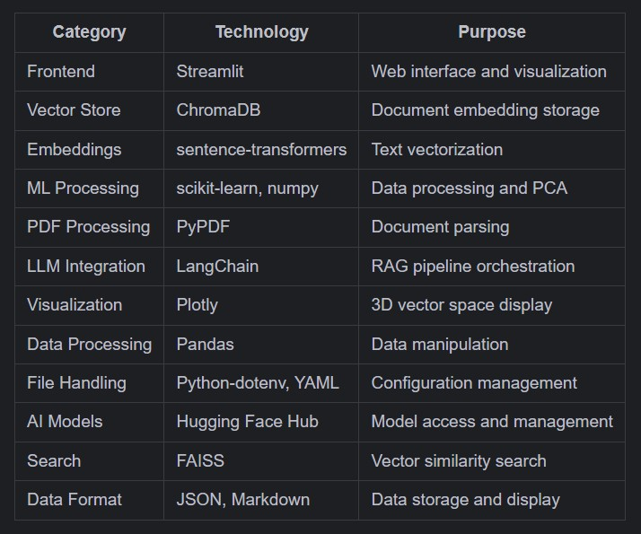
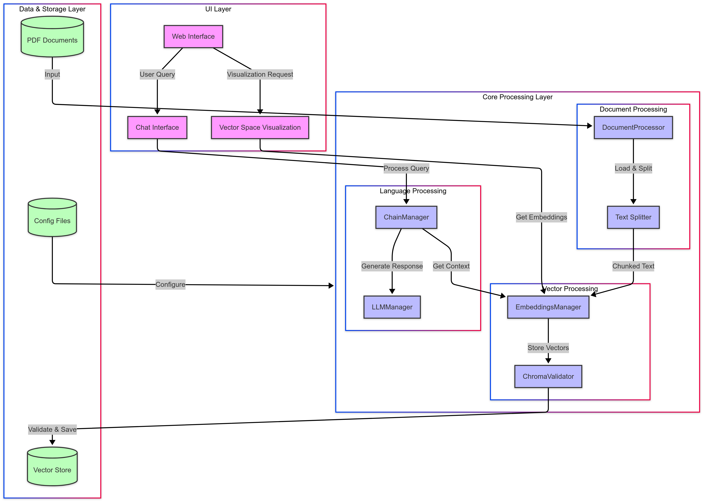

# Let's Build HealthIQ AI - A Vertical AI Agent System

Transforming Healthcare Intelligence: Building a Professional Medical AI Assistant from Ground Up

## TL;DR

A practical implementation of an AI-powered B2B order management system using LangChain and LLM, demonstrating automated order processing, inventory management, and real-time communication between trading partners.

Full Article : [https://medium.com/@learn-simplified/lets-build-healthiq-ai-a-vertical-ai-agent-system-72c40a4560ad


## Tech stack




## Introduction
Picture walking into a doctor’s office where AI understands medical knowledge as thoroughly as a seasoned practitioner. That’s exactly what inspired building HealthIQ AI. This isn’t just another chatbot — it’s a specialized medical assistant that combines document understanding, vector search, and natural language processing to provide reliable healthcare guidance.

## Architecture




## What’s This Article About?
This article walks through building a professional medical AI system from scratch. Starting with document processing, moving through vector embeddings, and culminating in an intuitive chat interface, each component serves a specific purpose. The system processes medical PDFs, creates searchable vector representations, and generates contextual responses using language models. What makes it special is the visual exploration of medical knowledge through an interactive 3D interface, helping users understand relationships between different medical concepts.


## Why Read It?
As businesses race to integrate AI, healthcare stands at the forefront of potential transformation. This article provides a practical blueprint for implementing a vertical AI solution in the medical domain. While HealthIQ AI serves as our example, the architecture and techniques demonstrated here apply to any industry-specific AI implementation. The modular design shows how to combine document processing, vector search, and language models into a production-ready system that could transform how organizations handle specialized knowledge.


# Tutorial: Let's Build HealthIQ AI - A Vertical AI Agent System

## Prerequisites
- Python installed on your system.
- A basic understanding of virtual environments and command-line tools.

## Steps

1. **Virtual Environment Setup:**
   - Create a dedicated virtual environment for our project:
   
     ```bash
     python -m venv Lets-Build-HealthIQ-AI
     ```
   - Activate the environment:
   
     - Windows:
       ```bash
       Lets-Build-HealthIQ-AI\Scripts\activate       
       ```
     - Unix/macOS:
       ```bash
       source Lets-Build-HealthIQ-AI/bin/activate
       ```
   

# Installation and Setup Guide

**Install Project Dependencies:**

Follow these steps to set up and run the  "Let's Build HealthIQ AI - A Vertical AI Agent System"

1. Navigate to your project directory:
   ```
   cd path/to/your/project
   ```
   This ensures you're in the correct location for the subsequent steps.

2. Install the required dependencies:
   ```
   pip install -r requirements.txt   
   ```
   This command installs all the necessary Python packages listed in the requirements.txt file.


## Run - Hands-On Guide: Let's Build HealthIQ AI - A Vertical AI Agent System

   ```bash 
     
      # Run 
      streamlit run app.py
      
   ```


